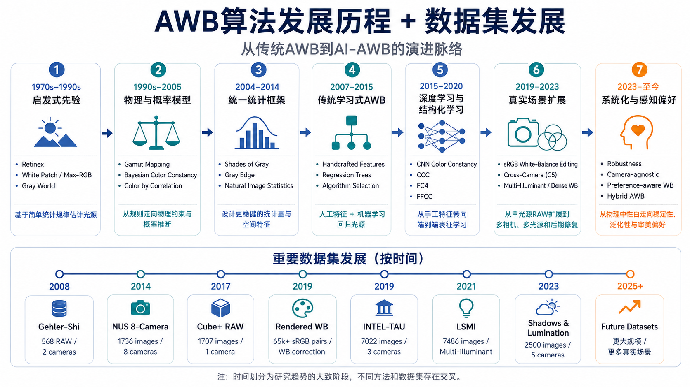

# Automatic White Balance (AWB) Learning Roadmap

> 自动白平衡学习路线：从统计先验、物理模型与传统机器学习，到深度学习、跨相机泛化、多光源建模和感知偏好。

自动白平衡（Automatic White Balance，AWB）是相机图像信号处理（ISP）中的关键环节。它需要从图像中估计场景光源，并校正光照造成的颜色偏移，使物体在不同光照下仍呈现稳定、自然的颜色。

这份 Roadmap 不追求覆盖所有 AWB 工作，而是围绕两条主线组织代表性内容：

- **算法如何演进**：从简单统计规律，发展到物理/概率建模、学习式方法和系统级 AWB。
- **问题如何扩展**：从单相机、单光源 RAW 图像，扩展到跨相机、多光源、sRGB 后处理、视频和真实设备部署。

## Roadmap



| 阶段 | 年代 | 代表方法 / 工作 | 重点 | 优先级 |
| --- | --- | --- | --- | :---: |
| 启发式先验 | 1970s–1990s | Retinex、White Patch / Max-RGB、Gray World | 从像素强度或通道统计中直接估计光源，建立 AWB 的基本问题形式 | ⭐⭐⭐ |
| 物理与概率模型 | 1990s–2005 | Gamut Mapping、Bayesian Color Constancy、Color by Correlation | 从规则方法走向成像约束、颜色分布与概率推断 | ⭐⭐ |
| 统一统计框架 | 2004–2014 | [Shades of Gray](https://doi.org/10.1117/1.1924555)、Gray Edge、Natural Image Statistics | 用 Minkowski 范数、图像导数和自然图像统计统一多类传统方法 | ⭐⭐⭐ |
| 传统学习式 AWB | 2007–2015 | 手工特征、[Regression Trees](https://openaccess.thecvf.com/content_cvpr_2015/html/Cheng_Effective_Learning-Based_Illuminant_2015_CVPR_paper.html)、Algorithm Selection | 从固定先验转向由数据选择特征、回归器或算法组合 | ⭐⭐ |
| 深度学习与结构化学习 | 2015–2020 | [CNN Color Constancy](https://openaccess.thecvf.com/content_cvpr_workshops_2015/W03/html/Bianco_Color_Constancy_Using_2015_CVPR_paper.html)、[CCC](https://openaccess.thecvf.com/content_iccv_2015/html/Barron_Convolutional_Color_Constancy_ICCV_2015_paper.html)、[FC4](https://openaccess.thecvf.com/content_cvpr_2017/html/Hu_FC4_Fully_Convolutional_CVPR_2017_paper.html)、[FFCC](https://openaccess.thecvf.com/content_cvpr_2017/html/Barron_Fast_Fourier_Color_CVPR_2017_paper.html) | 从手工特征转向端到端特征学习、置信度聚合与高效推理 | ⭐⭐⭐ |
| 真实场景扩展 | 2019–2023 | [sRGB White-Balance Editing](https://openaccess.thecvf.com/content_CVPR_2019/html/Afifi_When_Color_Constancy_Goes_Wrong_Correcting_Improperly_White-Balanced_Images_CVPR_2019_paper.html)、[Cross-Camera C5](https://openaccess.thecvf.com/content/ICCV2021/html/Afifi_Cross-Camera_Convolutional_Color_Constancy_ICCV_2021_paper.html)、Multi-Illuminant / Dense WB | 从单光源 RAW 估计扩展到相机渲染图像、未知传感器和空间变化光照 | ⭐⭐⭐ |
| 系统化与感知偏好 | 2023–至今 | Robustness、Camera-agnostic、Preference-aware WB、Hybrid AWB | 将物理中性、跨域稳定性、实时部署和人眼审美纳入统一系统 | ⭐⭐⭐ |

`⭐⭐⭐` 表示建议重点理解的主线内容，`⭐⭐` 表示重要扩展。

## Recommended Learning Order

如果第一次系统学习 AWB，建议先理解问题假设，再逐步放宽真实场景约束：

```text
成像模型与颜色恒常性
        ↓
Gray World / White Patch
        ↓
Gamut Mapping / Bayesian Methods
        ↓
Shades of Gray / Gray Edge
        ↓
Handcrafted Features / Regression Trees
        ↓
CNN / CCC / FC4 / FFCC
        ↓
sRGB WB Editing
        ↓
Cross-Camera / Camera-Agnostic AWB
        ↓
Multi-Illuminant / Temporal AWB
        ↓
Robust、Efficient、Preference-aware Hybrid AWB
```

学习时可以持续追问三个问题：

1. **估计什么？** 全局光源颜色、局部光照图，还是最终白平衡结果？
2. **依赖什么？** 统计先验、成像物理、相机光谱响应、监督数据，还是场景语义？
3. **在哪里运行？** RAW 域、线性 RGB、相机渲染后的 sRGB，还是实时 ISP / 视频管线？

## How the Main Ideas Evolved

| 研究问题 | 主要演进 |
| --- | --- |
| 如何估计光源？ | 简单通道统计 → 色域与概率模型 → 数据驱动回归 → 端到端特征学习 |
| 使用什么输入？ | 单张 RAW → 线性 RGB → 已渲染 sRGB → 视频与上下文信息 |
| 如何处理空间变化？ | 单一全局光源 → 局部块估计 → 稠密光照图 → 多光源分解与融合 |
| 如何适配不同设备？ | 单相机标定 → 多相机训练 → 跨相机适配 → Camera-agnostic AWB |
| 如何兼顾稳定性？ | 单帧精度 → 置信度建模 → 时序平滑 → 鲁棒系统级决策 |
| 什么是“正确”的白平衡？ | 物理中性 → 感知自然 → 场景语义 → 用户与品牌风格偏好 |
| 如何进入真实 ISP？ | 离线算法 → 高效网络 → 轻量化 / 低功耗 → 物理先验与 AI 混合方案 |

## Chronological Paper List

按发表年份组织的论文清单，概述各论文提出的方法、理论、数据集或评测贡献，并保留关键适用条件。

### 理论基础与物理建模：1971–1994

| 年份 | 论文 | 核心贡献 |
| --- | --- | --- |
| 1971 | [**Lightness and Retinex Theory**](https://www.cs.jhu.edu/~misha/ReadingSeminar/Papers/Land71.pdf) | 提出 Retinex 明度计算模型，在不同波段内通过局部亮度比与空间路径积分估计相对明度，解释光照变化下的明度与颜色恒常现象。 |
| 1980 | [**A Spatial Processor Model for Object Colour Perception**](https://doi.org/10.1016/0016-0032(80)90058-7) | 利用整个视野的空间平均颜色信息估计照明，并结合低维光谱表示恢复物体颜色，为 Gray World 的全局统计假设提供模型基础。 |
| 1985 | [**Using Color to Separate Reflection Components**](https://doi.org/10.1002/col.5080100409) | 提出二色反射模型，将图像颜色分解为体反射与界面反射分量，并利用两者的光谱和几何差异分离漫反射与高光。 |
| 1986 | [**Method for Computing the Scene-Illuminant Chromaticity from Specular Highlights**](https://doi.org/10.1364/JOSAA.3.001694) | 利用不同表面镜面高光在色度空间中的几何约束，求取共同的光源色度，将高光信息转化为光源估计依据。 |
| 1986 | [**Color Constancy: A Method for Recovering Surface Spectral Reflectance**](https://doi.org/10.1364/JOSAA.3.000029) | 用低维基函数表示表面反射率与光源光谱，分析在未知照明下从多通道图像恢复表面光谱反射率的条件。 |
| 1989 | [**Standard Surface-Reflectance Model and Illuminant Estimation**](https://doi.org/10.1364/JOSAA.6.000576) | 建立包含漫反射和镜面反射的标准表面反射模型，利用颜色向量的几何结构约束光源光谱估计。 |
| 1990 | [**A Novel Algorithm for Color Constancy**](https://doi.org/10.1007/BF00056770) | 提出色域映射方法，以参考光源下可出现的颜色范围约束当前图像的颜色变换，从可行映射集合中推断光源。 |
| 1994 | [**Color Constancy: Generalized Diagonal Transforms Suffice**](https://doi.org/10.1364/JOSAA.11.003011) | 证明在特定低维反射率与光源光谱假设下，适当变换传感器基底后可用对角矩阵表达光照变化，给出独立通道增益校正的成立条件。 |
| 1994 | [**Spectral Sharpening: Sensor Transformations for Improved Color Constancy**](https://opg.optica.org/josaa/abstract.cfm?uri=josaa-11-5-1553) | 提出光谱锐化，通过线性变换使有效传感器响应更集中，从而改善对角通道缩放对光照变化的近似。 |

### Gamut、概率模型与学习思想萌芽：1996–2002

| 年份 | 论文 | 核心贡献 |
| --- | --- | --- |
| 1996 | [**Color in Perspective**](https://doi.org/10.1109/34.541413) | 将三维颜色色域映射转化为归一化色度空间中的约束求解，降低亮度变化的影响并简化光源估计。 |
| 1996 | [**Learning Color Constancy**](https://library.imaging.org/cic/articles/4/1/art00016) | 训练神经网络从颜色分布预测光源色度，利用反射率、光源与相机响应合成训练数据，实现数据驱动的颜色恒常估计。 |
| 1997 | [**Bayesian Color Constancy**](https://doi.org/10.1364/JOSAA.14.001393) | 将成像模型与光源、反射率先验结合，通过贝叶斯后验和决策规则估计光源，显式处理观测的不确定性。 |
| 1999 | [**Selection for Gamut Mapping Colour Constancy**](https://doi.org/10.1016/S0262-8856(98)00179-6) | 改进色域映射中的可行解选择，在消除透视归一化造成的几何偏差后聚合候选映射，减少选择策略引入的估计偏差。 |
| 2001 | [**Color by Correlation: A Simple, Unifying Framework for Color Constancy**](https://doi.org/10.1109/34.969113) | 构建图像颜色与候选光源之间的相关矩阵，通过颜色分布的相关性评估候选光源，统一色域约束与概率估计。 |
| 2002 | [**A Comparison of Computational Color Constancy Algorithms—Part I**](https://doi.org/10.1109/TIP.2002.802531) | 在可控的合成成像条件下系统比较颜色恒常算法，分析光源、表面与成像条件变化对估计误差的影响。 |
| 2002 | [**A Comparison of Computational Color Constancy Algorithms—Part II**](https://doi.org/10.1109/TIP.2002.802529) | 在真实图像上系统评估颜色恒常算法，检验合成实验中的结论在实际采集条件下的适用性。 |

### 经典统计 CC 的成熟期：2004–2007

| 年份 | 论文 | 核心贡献 |
| --- | --- | --- |
| 2004 | [**Shades of Gray and Colour Constancy**](https://library.imaging.org/cic/articles/12/1/art00008) | 以 Minkowski 范数估计各通道的光源响应，将 Gray World 与 Max-RGB 作为不同范数参数下的特例统一起来。 |
| 2004 | [**Color Constancy through Inverse-Intensity Chromaticity Space**](https://doi.org/10.1364/JOSAA.21.000321) | 提出逆强度色度空间，将二色反射模型中的高光变化转化为线性几何关系，据此估计光源色度。 |
| 2005 | [**A Combined Physical and Statistical Approach to Colour Constancy**](https://doi.org/10.1109/CVPR.2005.20) | 将二色反射的物理约束与 Color by Correlation 的统计证据结合，对候选光源进行联合评估。 |
| 2007 | [**Edge-Based Color Constancy**](https://doi.org/10.1109/TIP.2007.901808) | 提出 Gray Edge，假设图像反射率导数的平均颜色为无彩色，并用导数阶数、平滑尺度和 Minkowski 范数统一多种统计估计器。 |
| 2007 | [**Using High-Level Visual Information for Color Constancy**](https://doi.org/10.1109/ICCV.2007.4409109) | 利用语义类别的典型反射颜色生成光源估计，并根据高层视觉信息选择候选光源，将场景内容引入颜色恒常推断。 |
| 2007 | [**Color Constancy Using Natural Image Statistics**](https://doi.org/10.1109/CVPR.2007.383206) | 用 Weibull 分布参数描述自然图像的对比度与纹理统计，据此选择或组合适合当前图像的颜色恒常算法。 |

### Benchmark、自然图像统计与场景先验：2008–2014

| 年份 | 论文 | 核心贡献 |
| --- | --- | --- |
| 2008 | [**Bayesian Color Constancy Revisited**](https://www.microsoft.com/en-us/research/publication/bayesian-color-constancy-revisited/) | 发布含 568 张 RAW 图像及光源标注的数据集，并用数据估计更准确的光源与反射率先验，改进贝叶斯光源估计。 |
| 2008 | [**Color Constancy Beyond Bags of Pixels**](https://doi.org/10.1109/CVPR.2008.4587664) | 学习自然图像颜色的空间依赖关系，以校正后图像符合该统计模型的程度估计光源，将空间结构纳入概率推断。 |
| 2009 | [**Color Constancy Using 3D Scene Geometry**](https://doi.org/10.1109/ICCV.2009.5459391) | 根据粗略三维场景几何划分图像区域，为不同几何类别选择适合的颜色恒常策略并融合估计结果。 |
| 2010 | [**Generalized Gamut Mapping Using Image Derivative Structures for Color Constancy**](https://doi.org/10.1007/s11263-008-0171-3) | 把色域映射从像素颜色推广到图像导数及其组合结构，利用边缘和更高阶局部信息约束可行光源。 |
| 2011 | [**Color Constancy Using Natural Image Statistics and Scene Semantics**](https://doi.org/10.1109/TPAMI.2010.93) | 结合自然图像统计与场景语义学习算法选择和组合规则，使光源估计策略随图像内容变化。 |
| 2011 | [**Computational Color Constancy: Survey and Experiments**](https://doi.org/10.1109/TIP.2011.2118224) | 系统归纳统计、物理和学习式颜色恒常方法，并通过统一实验比较算法表现及其对参数、数据和评测条件的依赖。 |
| 2012 | [**Color Constancy with Spatio-Spectral Statistics**](https://doi.org/10.1109/TPAMI.2011.252) | 建立联合描述空间结构与光谱相关性的自然图像统计模型，通过最大似然推断估计光源。 |
| 2012 | [**Color Constancy by Category Correlation**](https://doi.org/10.1109/TIP.2011.2171353) | 利用基本颜色类别的分布作为先验，通过校正后图像与颜色类别之间的相关性评价候选光源。 |
| 2012 | [**Color Constancy for Multiple Light Sources**](https://staff.fnwi.uva.nl/th.gevers/pub/GeversTIP12-2.pdf) | 将全局颜色恒常算法用于局部区域，融合局部光源估计并进行空间变化的颜色校正，以处理多个光源。 |
| 2013 | [**Corrected-Moment Illuminant Estimation**](https://openaccess.thecvf.com/content_iccv_2013/html/Finlayson_Corrected-Moment_Illuminant_Estimation_2013_ICCV_paper.html) | 对图像颜色或导数的统计矩学习线性校正，并通过交替优化拟合参数，将传统统计估计器转化为可学习模型。 |
| 2014 | [**Illuminant Estimation for Color Constancy: Why Spatial-Domain Methods Work and the Role of the Color Distribution**](https://doi.org/10.1364/JOSAA.31.001049) | 分析空间域方法与图像颜色分布的关系，提出基于亮暗像素颜色分布的光源估计方法，并提供 NUS 多相机评测数据。 |
| 2014 | [**Exemplar-Based Colour Constancy and Multiple Illumination**](https://www.cs.sfu.ca/~mark/ftp/Pami2014/pami2014.pdf) | 为训练图像中的表面建立样例模型，通过纹理与颜色检索相似表面、匹配颜色统计来估计局部光源，并扩展到多光源校正。 |
| 2014 | [**Reproduction Angular Error: An Improved Performance Metric for Illuminant Estimation**](https://www.bmva-archive.org.uk/bmvc/2014/papers/paper047/index.html) | 提出 reproduction angular error，以白平衡后真实白色与理想白色之间的夹角衡量残余偏色，使评价直接关联校正结果。 |

### Learning-Based → Deep Learning 与跨相机评测：2015–2018

| 年份 | 论文 | 核心贡献 |
| --- | --- | --- |
| 2015 | [**Effective Learning-Based Illuminant Estimation Using Simple Features**](https://openaccess.thecvf.com/content_cvpr_2015/html/Cheng_Effective_Learning-Based_Illuminant_2015_CVPR_paper.html) | 从图像提取简单颜色统计特征，使用回归树集成预测光源，在低特征提取成本下实现学习式估计。 |
| 2015 | [**Color Constancy Using CNNs**](https://openaccess.thecvf.com/content_cvpr_workshops_2015/W03/html/Bianco_Color_Constancy_Using_2015_CVPR_paper.html)（CVPR Workshop 2015） | 使用 CNN 从局部图像块回归光源颜色，再聚合局部预测得到全局光源，学习用于估计照明的图像特征。 |
| 2015 | [**Convolutional Color Constancy**](https://openaccess.thecvf.com/content_iccv_2015/html/Barron_Convolutional_Color_Constancy_ICCV_2015_paper.html) | 将光照引起的通道缩放转化为对数色度直方图的平移，通过学习卷积滤波器把光源估计表述为二维定位问题。 |
| 2015 | [**Color Constancy by Learning to Predict Chromaticity from Luminance**](https://arxiv.org/abs/1506.02167)（arXiv 版本） | 学习由亮度信息预测色度分布的模型，以预测分布评价观测颜色在候选光源下的可能性，据此估计照明。 |
| 2015 | [**Efficient Illuminant Estimation for Color Constancy Using Grey Pixels**](https://openaccess.thecvf.com/content_cvpr_2015/html/Yang_Efficient_Illuminant_Estimation_2015_CVPR_paper.html) | 利用对数域的局部强度变化检测近似灰像素，再由这些像素的颜色估计光源，无需训练光源回归模型。 |
| 2015 | [**Beyond White: Ground Truth Colors for Color Constancy Correction**](https://openaccess.thecvf.com/content_iccv_2015/html/Cheng_Beyond_White_Ground_ICCV_2015_paper.html) | 提供彩色色块的参考颜色，将评测扩展到整体颜色复现，并研究完整颜色变换相对于仅校正白点的作用。 |
| 2016 | [**Deep Specialized Network for Illuminant Estimation**](https://mmlab.ie.cuhk.edu.hk/projects/illuminant_estimation.html) | 以 HypNet 为局部图像生成多个光源假设，再由 SelNet 选择合适预测，显式建模局部外观对应多种照明的歧义。 |
| 2017 | [**Approaching the Computational Color Constancy as a Classification Problem through Deep Learning**](https://doi.org/10.1016/j.patcog.2016.08.013) | 将连续光源估计转化为光源类别预测，通过深度分类网络学习图像与候选照明之间的对应关系。 |
| 2017 | [**FC4: Fully Convolutional Color Constancy with Confidence-Weighted Pooling**](https://openaccess.thecvf.com/content_cvpr_2017/html/Hu_FC4_Fully_Convolutional_CVPR_2017_paper.html) | 联合预测局部光源与置信度，通过置信度加权池化得到全局估计，使网络学习各区域对光源推断的可靠性。 |
| 2017 | [**Fast Fourier Color Constancy**](https://openaccess.thecvf.com/content_cvpr_2017/html/Barron_Fast_Fourier_Color_CVPR_2017_paper.html) | 在周期化对数色度空间中使用傅里叶卷积加速光源定位，并估计光源概率分布以支持不确定性建模和时序融合。 |
| 2017 | [**Recurrent Color Constancy**](https://openaccess.thecvf.com/content_iccv_2017/html/Qian_Recurrent_Color_Constancy_ICCV_2017_paper.html) | 通过卷积循环网络聚合图像序列信息，利用多帧观测中的内容与时间联系改善光源估计。 |
| 2018 | [**A Dataset for Camera Independent Color Constancy**](https://researchportal.tuni.fi/en/publications/a-dataset-for-camera-independent-color-constancy/) | 提供多相机拍摄的对应场景、相机光谱响应和实验室光源光谱，并包含颜色渐晕相关数据，支持相机独立方法的验证。 |

### 从 Benchmark Accuracy 转向真实问题：2019–2020

| 年份 | 论文 | 核心贡献 |
| --- | --- | --- |
| 2019 | [**Quasi-Unsupervised Color Constancy**](https://openaccess.thecvf.com/content_CVPR_2019/html/Bianco_Quasi-Unsupervised_Color_Constancy_CVPR_2019_paper.html) | 用近似已白平衡图像训练 CNN 从灰度图检测无彩色像素，再按检测权重聚合原图颜色估计光源；训练不需要光源真值，但依赖图像已近似平衡的假设。 |
| 2019 | [**On Finding Gray Pixels**](https://openaccess.thecvf.com/content_CVPR_2019/html/Qian_On_Finding_Gray_Pixels_CVPR_2019_paper.html) | 基于二色反射模型设计 Grayness Index，从偏色图像中筛选近似灰像素，并用于单光源及多光源估计。 |
| 2019 | [**When Color Constancy Goes Wrong: Correcting Improperly White-Balanced Images**](https://openaccess.thecvf.com/content_CVPR_2019/html/Afifi_When_Color_Constancy_Goes_Wrong_Correcting_Improperly_White-Balanced_Images_CVPR_2019_paper.html) | 从不同白平衡设置渲染的成对图像学习颜色校正映射，利用相似图像检索与映射融合修正已渲染 sRGB 图像的错误白平衡。 |
| 2019 | [**The Past and the Present of the Color Checker Dataset Misuse**](https://arxiv.org/abs/1903.04473)（arXiv 版本） | 梳理 ColorChecker 数据及光源标注的使用差异，分析黑电平处理等错误对实验结果的影响，明确跨论文比较所需的数据一致性。 |
| 2019 | [**Formulating Camera-Adaptive Color Constancy as a Few-shot Meta-Learning Problem**](https://smcdonagh.github.io/publication/meta_awb/)（ICCV Workshop 2019） | 将新相机适配表述为少样本元学习任务，学习可快速更新的模型初始化；适配时需要目标相机的少量训练样本。 |
| 2019 | [**Dichromatic Model Based Temporal Color Constancy for AC Light Sources**](https://openaccess.thecvf.com/content_CVPR_2019/html/Yoo_Dichromatic_Model_Based_Temporal_Color_Constancy_for_AC_Light_Sources_CVPR_2019_paper.html) | 利用高速摄影捕捉交流光源的周期变化，将时序观测与二色反射模型结合推断光源；依赖相应的光源变化与采集条件。 |
| 2020 | [**Cascading Convolutional Color Constancy**](https://doi.org/10.1609/aaai.v34i07.6966) | 级联多个光源估计与颜色校正阶段，逐步减小输入偏色，使后续网络学习剩余光照误差。 |
| 2020 | [**A Multi-Hypothesis Approach to Color Constancy**](https://openaccess.thecvf.com/content_CVPR_2020/html/Hernandez-Juarez_A_Multi-Hypothesis_Approach_to_Color_Constancy_CVPR_2020_paper.html) | 用多个候选光源校正输入图像，由 CNN 评价各结果是否呈中性照明，再从候选光源的后验分布形成最终估计。 |
| 2020 | [**Multi-Domain Learning for Accurate and Few-Shot Color Constancy**](https://openaccess.thecvf.com/content_CVPR_2020/html/Xiao_Multi-Domain_Learning_for_Accurate_and_Few-Shot_Color_Constancy_CVPR_2020_paper.html) | 将不同相机视为不同域，联合学习共享表示与域相关参数，并以少量目标相机样本完成新域适配。 |
| 2020 | [**Deep White-Balance Editing**](https://openaccess.thecvf.com/content_CVPR_2020/html/Afifi_Deep_White-Balance_Editing_CVPR_2020_paper.html) | 采用共享编码器与多个白平衡解码器预测 sRGB 校正结果，再拟合颜色映射应用于原分辨率图像，实现自动校正和色温编辑。 |
| 2020 | [**Cross-dataset Color Constancy Revisited Using Sensor-to-Sensor Transfer**](https://www.bmvc2020-conference.com/assets/papers/0082.pdf) | 利用已知传感器光谱特性建立相机间颜色变换，将训练图像与光源标注迁移到其他传感器域，研究跨数据集泛化。 |
| 2020 | [**Bag of Color Features for Color Constancy**](https://trepo.tuni.fi/handle/10024/217447) | 将局部颜色特征量化为可学习的特征袋表示，并结合注意力与池化聚合全局信息，构建紧凑的光源估计模型。 |

### 泛化、自监督、多传感器：2021–2023

| 年份 | 论文 | 核心贡献 |
| --- | --- | --- |
| 2021 | [**CLCC: Contrastive Learning for Color Constancy**](https://openaccess.thecvf.com/content/CVPR2021/html/Lo_CLCC_Contrastive_Learning_for_Color_Constancy_CVPR_2021_paper.html) | 设计 RAW 域颜色增强及对比样本，使模型学习对照明变化敏感的特征，在不增加推理模型复杂度的条件下改善泛化。 |
| 2021 | [**Leveraging the Availability of Two Cameras for Illuminant Estimation**](https://openaccess.thecvf.com/content/CVPR2021/html/Abdelhamed_Leveraging_the_Availability_of_Two_Cameras_for_Illuminant_Estimation_CVPR_2021_paper.html) | 利用同一场景在两台不同光谱响应相机中的颜色差异，为光源估计引入额外成像约束；需要双相机观测。 |
| 2021 | [**Cross-Camera Convolutional Color Constancy**](https://openaccess.thecvf.com/content/ICCV2021/html/Afifi_Cross-Camera_Convolutional_Color_Constancy_ICCV_2021_paper.html) | 提出 C5，以目标相机的额外无标注图像为条件，通过超网络生成适配该相机的颜色恒常模型参数，处理训练中未见过的相机。 |
| 2021 | [**Large Scale Multi-Illuminant (LSMI) Dataset for Developing White Balance Algorithm Under Mixed Illumination**](https://www.dykim.me/projects/lsmi) | 采集大规模混合光照数据，提供逐像素光照、各光源颜色及混合比例真值，并建立逐像素白平衡基线。 |
| 2021 | [**A Benchmark for Burst Color Constancy**](https://trepo.tuni.fi/handle/10024/218396)（2021 正式版；2020 预印本题名为 A Benchmark for Temporal Color Constancy） | 提供 600 段真实拍摄序列与固定评测划分，并提出融合时间和图像内容信息的 TCCNet 基线，支持连拍光源估计比较。 |
| 2021 | [**INTEL-TAU: A Color Constancy Dataset**](https://trepo.tuni.fi/handle/10024/215902)（IEEE Access 2021；预印本发表于 2019 年） | 提供来自三台相机的 7,022 张图像及光源标注，包含颜色渐晕校正前后版本，并设置相机与场景泛化评测。 |
| 2022 | [**Degree-of-Linear-Polarization-Based Color Constancy**](https://openaccess.thecvf.com/content/CVPR2022/html/Ono_Degree-of-Linear-Polarization-Based_Color_Constancy_CVPR_2022_paper.html) | 利用线偏振度在无彩色表面上的物理性质识别灰像素并估计光源，进一步支持有色表面和多光源场景；需要偏振观测。 |
| 2022 | [**Auto White-Balance Correction for Mixed-Illuminant Scenes**](https://openaccess.thecvf.com/content/WACV2022/html/Afifi_Auto_White-Balance_Correction_for_Mixed-Illuminant_Scenes_WACV_2022_paper.html) | 学习空间变化的融合权重，组合不同白平衡预设渲染的图像，实现混合光照下的局部 sRGB 白平衡校正。 |
| 2023 | [**Learning Color Constancy: 30 Years Later**](https://library.imaging.org/cic/articles/31/1/17) | 重新实现早期神经网络颜色恒常方法，并更新训练配置，量化现代训练策略对经典网络性能的改善。 |
| 2023 | [**Ranking-Based Color Constancy With Limited Training Samples**](https://doi.org/10.1109/TPAMI.2023.3278832) | 学习传统统计估计器的排序，以低秩和稀疏约束降低小样本学习难度，再选择或融合高排名估计器；还研究用成对偏好代替光源标注。 |
| 2023 | [**Color Constancy: How to Deal with Camera Bias?**](https://proceedings.bmvc2023.org/643/) | 用预标定的颜色单应变换补偿相机偏差，比较校准前后的跨相机表现，并分析在该条件下简化模型的可行性。 |
| 2023 | [**Camera-Independent Color Constancy by Scene Semantics**](https://www.sciencedirect.com/science/article/pii/S0167865523001010) | 通过光照不变的场景语义检索相似样例，预测灰度假设所需的场景统计量，再间接计算光源，支持未见相机的推断。 |
| 2023 | [**Cascading Convolutional Temporal Color Constancy**](https://github.com/matteo-rizzo/cctcc)（Journal of Electronic Imaging 2023） | 将级联颜色校正引入时序网络，逐阶段修正序列中的光照偏差，并研究精度与计算开销的取舍。 |

### Multi-Illuminant、Attention、Spectral：2024–2025

| 年份 | 论文 | 核心贡献 |
| --- | --- | --- |
| 2024 | [**Spatio-Spectral Deep Color Constancy With Multi-Band NIR**](https://doi.org/10.1109/ACCESS.2024.3434574) | 以交叉注意力融合 RGB 与多波段近红外特征，联合估计局部光源和置信度，并引入 NIR 着色辅助任务及配套采集数据。 |
| 2024 | [**Attentive Illumination Decomposition Model for Multi-Illuminant White Balancing**](https://openaccess.thecvf.com/content/CVPR2024/html/Kim_Attentive_Illumination_Decomposition_Model_for_Multi-Illuminant_White_Balancing_CVPR_2024_paper.html) | 通过 Slot Attention 分解混合照明，联合估计各光源颜色与空间混合权重，重建逐像素光照并完成局部白平衡。 |
| 2024 | [**NightCC: Nighttime Color Constancy via Adaptive Channel Masking**](https://openaccess.thecvf.com/content/CVPR2024/papers/Li_NightCC_Nighttime_Color_Constancy_via_Adaptive_Channel_Masking_CVPR_2024_paper.pdf) | 用有标注日间数据和无标注夜间图像进行域适配，通过自适应特征通道掩码及逐像素光照不确定性降低噪声和错误伪标签的影响。 |
| 2024 | [**Effective Cross-Sensor Color Constancy Using a Dual-Mapping Strategy**](https://shuweiyue.com/pdf/josa-cross2024.pdf) | 利用训练与目标传感器的 D65 白点构建双重映射，重建图像和光源数据，再结合稀疏颜色特征与轻量 MLP 估计光源；需要目标传感器的 D65 白点标定。 |
| 2024 | [**Optimizing Illuminant Estimation in Dual-Exposure HDR Imaging**](https://www.ecva.net/papers/eccv_2024/papers_ECCV/papers/00206.pdf) | 针对双曝光 HDR 的光源估计，将长短曝光信息融合为双曝光特征，并设计轻量估计模型以利用两种曝光的互补信息。 |
| 2025 | [**Integral Fast Fourier Color Constancy**](https://openaccess.thecvf.com/content/CVPR2025/html/Wei_Integral_Fast_Fourier_Color_Constancy_CVPR_2025_paper.html) | 提出积分 UV 直方图以快速提取任意局部区域的颜色统计，结合并行傅里叶卷积和空间平滑，将 FFCC 扩展为高效多光源估计。 |
| 2025 | [**Accelerated Self-Supervised Multi-Illumination Color Constancy With Hybrid Knowledge Distillation**](https://doi.org/10.1109/TPAMI.2025.3583090) | 通过光照归一化与灰度着色任务预训练 Transformer 和 U-Net，经监督微调后将两类表示混合蒸馏到 CNN，兼顾多光源标注效率与推理开销。 |
| 2025 | [**Time-Aware Auto White Balance in Mobile Photography**](https://www.openaccess.thecvf.com/content/ICCV2025/papers/Afifi_Time-Aware_Auto_White_Balance_in_Mobile_Photography_ICCV_2025_paper.pdf) | 将拍摄时间、位置等上下文与相机元数据引入光源估计，为移动摄影提供与环境照明相关的先验。 |
| 2025 | [**CCMNet: Leveraging Calibrated Color Correction Matrices for Cross-Camera Color Constancy**](https://openaccess.thecvf.com/content/ICCV2025/html/Kim_CCMNet_Leveraging_Calibrated_Color_Correction_Matrices_for_Cross-Camera_Color_Constancy_ICCV_2025_paper.html) | 利用预标定 CCM 将候选光源映射到相机 RAW 空间，并编码相机特性、构造相机增强数据以改善跨相机泛化；需要目标相机的标定矩阵。 |
| 2025 | [**Revisiting Image Fusion for Multi-Illuminant White-Balance Correction**](https://openaccess.thecvf.com/content/ICCV2025/html/Serrano-Lozano_Revisiting_Image_Fusion_for_Multi-Illuminant_White-Balance_Correction_ICCV_2025_paper.html) | 用非线性 Transformer 融合不同白平衡预设图像，突破线性加权的颜色表达限制，并提供大规模多光源 sRGB 数据。 |
| 2025 | [**Learning Camera-Agnostic White-Balance Preferences**](https://openaccess.thecvf.com/content/ICCV2025W/MIPI/papers/Zhao_Learning_Camera-Agnostic_White-Balance_Preferences_ICCVW_2025_paper.pdf)（ICCV Workshop 2025） | 在相机无关的 XYZ 空间学习从中性白平衡到偏好白平衡的映射，借助相机颜色标定实现跨设备的偏好迁移。 |

### 2026 前沿：鲁棒性、光谱、VLM 与新架构

| 年份 | 论文 | 核心贡献 |
| --- | --- | --- |
| 2026 | [**Graph-Based Spectral Attention with Multi-Spectral Images for Illuminant Estimation**](https://openaccess.thecvf.com/content/WACV2026/html/Kang_Graph-Based_Spectral_Attention_with_Multi-Spectral_Images_for_Illuminant_Estimation_WACV_2026_paper.html) | 由预训练模型从 RGB 估计多光谱表示，再通过图结构的光谱注意力聚合波段关系以估计光源；输入不要求额外多光谱相机。 |
| 2026 | [**Boosting Illuminant Estimation in Deep Color Constancy through Brightness Robustness Enhancement**](https://doi.org/10.1016/j.patcog.2025.112153) | 设计自适应步长的对抗亮度增强，结合亮度对抗训练与对比约束降低估计对亮度变化的敏感性，无需增加推理阶段的模型开销。 |
| 2026 | [**CSNet: A Content and Structure-Aware Approach for Color Constancy**](https://www.sciencedirect.com/science/article/pii/S1077314226000056) | 将图像分解为亮度均值、变化幅度与方向，通过内容加权和自适应融合构建表示，再由光源预测网络联合利用内容与结构信息。 |
| 2026 | [**White-Balance First, Adjust Later: Cross-Camera Color Constancy via Vision-Language Evaluation**](https://openaccess.thecvf.com/content/CVPR2026/html/Li_White-Balance_First_Adjust_Later_Cross-Camera_Color_Constancy_via_Vision-Language_Evaluation_CVPR_2026_paper.html) | 先按当前光源估计校正图像并映射到伪 sRGB，再用适配后的视觉语言模型评价残余偏色方向，迭代更新光源估计；转换依赖相机颜色映射。 |
| 2026 | [**CC-Mamba: Mamba-Based Color Constancy with Illumination Prior-Guided Dynamic Feature Modulation and Wavelet-Domain Attention Mechanism**](https://doi.org/10.1016/j.neucom.2026.133068) | 以 VMamba 建模全局依赖，结合小波域注意力、光照先验引导的动态特征调制及多尺度门控融合，提高光源估计对局部细节和复杂照明的建模能力。 |


## Datasets

数据集推动了 AWB 从单相机、单光源估计逐步走向跨相机和多光源场景。下表中的规模按本仓库路线图所采用的版本统计；实际使用前应确认数据版本、RAW 黑电平、颜色空间、色卡掩码和官方划分。

| 年份 | 数据集 | 规模 | 相机 | 主要特点 / 用途 | 资源 |
| --- | --- | ---: | ---: | --- | --- |
| 2008 | Gehler–Shi | 568 张 RAW | 2 | 经典单光源基准；包含室内、室外与近景图像 | [数据与说明](https://www.cs.sfu.ca/~colour/data/) |
| 2014 | NUS 8-Camera | 1,736 张 | 8 | 多传感器采集，适合研究相机相关性与跨相机泛化 | [项目与数据](https://yorkucvil.github.io/projects/public_html/illuminant/illuminant.html) |
| 2017 | Cube+ | 1,707 张 | 1 | 使用 SpyderCube 标注，场景与光源分布更丰富 | [官方页面](https://ipg.fer.hr/ipg/resources/color_constancy) |
| 2019 | Rendered WB | 65K+ sRGB 图像对 | 多设备 | 面向相机渲染后图像的白平衡校正，而非仅在 RAW 域估计光源 | [项目与数据](https://yorkucvil.github.io/projects/public_html/sRGB_WB_correction/dataset.html) |
| 2019 | INTEL-TAU | 7,022 张 | 3 | 大规模高分辨率数据；支持场景不变性、相机不变性与色彩渐晕研究 | [官方数据页](https://researchportal.tuni.fi/en/datasets/intel-tau/) · [论文](https://arxiv.org/abs/1910.10404) |
| 2021 | LSMI | 7,486 张 | 3 | 包含两种或三种光源，提供逐像素照明与混合比例真值 | [项目、论文与数据](https://www.dykim.me/projects/lsmi) |
| 2023 | Shadows & Lumination | 2,500 张 | 5 | 真实双光源场景，包含照明估计值与逐像素区域掩码 | [论文与数据说明](https://doi.org/10.1016/j.eswa.2023.120045) |

数据集选择建议：

- **基础单光源评测**：Gehler–Shi、Cube+。
- **跨相机泛化**：NUS 8-Camera、INTEL-TAU。
- **sRGB 后处理白平衡**：Rendered WB。
- **多光源与局部 AWB**：LSMI、Shadows & Lumination。

## Challenges & Future Directions


### 当前核心挑战

1. **多光源建模**：真实场景常由太阳、天空、室内灯和局部光源共同照明，单一全局增益容易产生局部偏色。
2. **跨相机泛化**：不同传感器具有不同的光谱响应，同一模型可能依赖训练相机，迁移到未知设备后性能下降。
3. **时序稳定性**：视频、预览和录像不仅要求单帧准确，还要避免白平衡闪烁、突变和场景切换时的震荡。
4. **数据偏差**：训练数据在场景、地域、光照、肤色和设备分布上可能不均衡，实验指标未必代表真实用户场景。
5. **效率与部署**：移动端 ISP 对延迟、吞吐、功耗、内存和硬件算子都有严格约束。
6. **目标定义冲突**：物理中性的结果不一定最自然；客观色差、用户偏好和品牌色彩风格可能彼此冲突。

### 未来发展趋势

1. **物理先验与 AI 融合**：把成像模型、光源约束与学习式模型结合，提升可解释性与稳健性。
2. **语义与上下文理解**：利用人物、天空、植被、室内外环境等语义信息辅助光源判断。
3. **偏好感知白平衡**：从唯一“正确”答案扩展到符合场景、用户审美和品牌风格的多目标结果。
4. **局部 / 稠密 AWB**：从全局 RGB 增益转向空间光照场、物体级估计和连续局部校正。
5. **相机无关泛化**：减少对已知传感器和逐设备标定数据的依赖，提升跨模组、跨平台适配能力。
6. **高效轻量 Hybrid AWB**：由传统方法提供可靠先验或回退机制，由学习模型处理复杂场景与感知决策。

这些方向是基于当前问题形态给出的研究路线展望，并不表示所有方向已经形成统一定义或成熟解决方案。

## Current Focus

当前推荐重点关注：

```text
成像物理与统计先验
    → 深度特征与结构化估计
    → 跨相机泛化
    → 多光源与时序稳定
    → 轻量部署
    → 感知偏好与系统级 Hybrid AWB
```

目标不是记住所有方法名称，而是逐步理解真实相机系统中的几个核心矛盾：

**精度 ↔ 稳定性 ↔ 泛化能力 ↔ 推理效率 ↔ 感知偏好**

> 本仓库用于记录 AWB 算法、数据集和研究方向的学习路线，并将随着学习过程持续更新。
